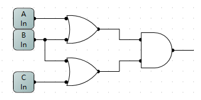
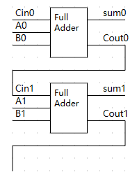
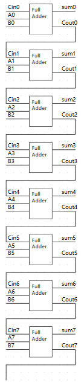

# 3 Representations of AND Gate

与门，当输入均为 1 时，输出才为 1；否则输出为0.

1. Math Expression

AB

2. Truth Table

 A | B | O
:-:|:-:|:-:
0|0|0
0|1|0
1|0|0
1|1|1

3. Circuit Diagram

 

# 3 Representations of XOR Gate

异或门，当输入不同时输出为 1；否则为 0.

1. Math Expression

A ⊕ B

2. Truth Table

A | B | O
:-:|:-:|:-:
0|0|0
0|1|1
1|0|1
1|1|0

3. Circuit Diagram

 

# Circuit Diagram of (A + B)(B + C)

 

# Truth Table of the Circuit Diagram

A | B | O
:-:|:-:|:-:
0|0|1
0|1|1
1|0|0
1|1|1

 

# Proof of (AB)’ = A’ + B’

The following is the truth table of (AB)'

A | B | O
:-:|:-:|:-:
0|0|1
0|1|1
1|0|1
1|1|0

The following is the truth table of A' + B'

A | B | O
:-:|:-:|:-:
0|0|1
0|1|1
1|0|1
1|1|0

The two truth tables above are identical.

 

# 8-Bit Adder

Repeat a full adder 2 times and get:

Repeat it 8 times and get:

 

# Mask
(X8 X7 X6 X5 X4 X3 X2 X1)2 or (00001111)2 = (X8 X7 X6 X5 1111)2

(X8 X7 X6 X5 X4 X3 X2 X1)2 xor (00001111)2 = (X8 X7 X6 X5 X4' X3' X2' X1')2

((X8 X7 X6 X5 X4 X3 X2 X1)2 and (11110000)2) or (not(X8 X7 X6 X5 X4 X3 X2 X1)2 and (00001111)2)

= (X8 X7 X6 X5 X4 0000)2 or (0000 X4' X3' X2' X1')

= (X8 X7 X6 X5 X4' X3' X2' X1')2

# Explanation of Some Words

The following explanations are all from Wikipedia.

## Logic gate

In electronics, a logic gate is an idealized or physical device implementing a Boolean function; that is, it performs a logical operation on one or more binary inputs and produces a single binary output.

在电子学领域里，逻辑门是一种实现了布尔函数的理想化的物理设备，即，它进行一种逻辑运算，接受一个或多个二进制输入并输出一个二进制输出。

## Boolean algebra

In mathematics and mathematical logic, Boolean algebra is the branch of algebra in which the values of the variables are the truth values true and false, usually denoted 1 and 0 respectively.

在数学和逻辑学领域里，布尔代数是一种代数的分支，它的变量的值为真或假，一般分别用 1 或 0 来表示。

# Flip-flop

中文翻译是触发器

An SR Latch can store 1 bit.
