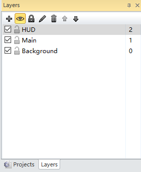
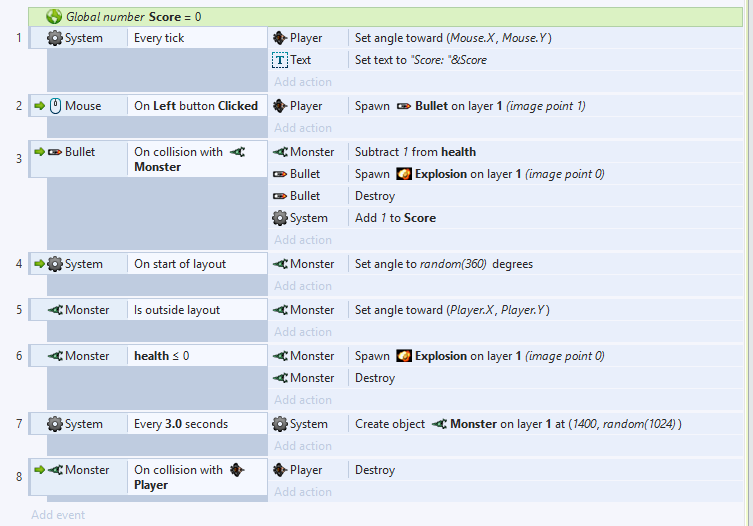

# Construct 2引擎简介

>Construct 2 is a powerful ground breaking HTML5 game creator designed specifically for 2D games. It allows anyone to build games — no coding required!

Construct 2这款游戏引擎，最大的特点莫过于 “no coding required” 了。它使得更多的人可以快速、方便地制作一个小型HTML5游戏，本文将对其基本功能简单介绍。

 

## 界面

打开Construct 2的一个项目，就能看到清晰、简洁的界面布局。左侧是某个对象的各种属性，右侧是项目的分层结构。

 

## 对象

对象（Object）即为游戏中的物体，有具体的，也有抽象的。所谓 “面向对象” 正是指这些对象。每个对象都有自己的特点，都有独特的对各种情况的处理方式。

 

## 层次

右上角的窗口可以切换为 “层次” 。“层”是2D游戏里一个重要的概念，简单来说就是下层的对象会被上层的给遮住。一般情况下，会把游戏的背景（Background）放在最底层，任何对象都是在背景上面的；把UI放到最上层，保证UI永远不会被遮住，以提供给玩家关于游戏的数据（比如血量、得分）。

 

## 行为

Construct 2里的对象都具有零个、一个或多个被称作 “行为” （Behavior）的属性，该属性控制了这个对象该如何行动，比如沿8个方向行走、沿直线发射等等。每种行为还有各项参数（有的或许没有），来使这种行为更具 “个性化” ，更符合该对象的特点。比如可以设置子弹飞行速度为一个比较大的值。

 

## 事件

Event是最能体现这款游戏引擎 “no coding required” 特点的部分了。光有上面的行为一般情况下都还不够，还需要一些更 “具体” 一点的行为，这便是事件了。从图中可以看出，每个事件就像是在完成句子成分一样，当什么东西做了什么的时候，什么东西应该先干什么，再干什么。Construct 2里面提供了很多条件的判断，比如当左键按下时、某对象的某个参数为某个值时；也提供了很多动作，比如实例化某个对象、销毁某个对象。把这些结合起来，便可以实现稍微复杂一点的逻辑了。

 

## 不足之处

“no coding required”，也可以说是 “no coding allowed”。不能编写代码，注定无法实现过于复杂的逻辑，就算是真的实现了，也一定耗时耗力，且运行效率可能不高。玩英雄联盟时，大家喜欢一开始就右击下路河道直奔过去。这个在多障碍物条件下寻最短路（或者说几乎是最短的路）的功能，如果用Construct 2来实现，只怕不太现实。不过换句话说，Construct 2只能发布HTML5游戏，或许这些较为基础的功能已经足够了。

 

## 结语

Construct 2是一款优秀的游戏引擎，可以方便地在短时间内制作出好玩的小游戏，而且易于上手。虽然仍有一些不足，但是总体而言，仍然是利大于弊。此篇文章仅作简介，该引擎的[官网][1]有更加详细的入门教程，在此就不赘述了。最后，以官方教程的小游戏的成果图作结。

[1]: https://www.scirra.com/construct2 "Construct 2官网"