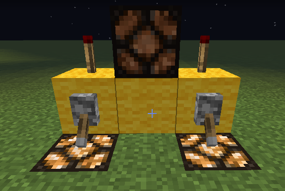

# Minecraft

提到Minecraft，很多人一定是立即联想到 “拆拆拆、建建建”，这确实是这个游戏的大部分内容。但是，本游戏最精华的部分，莫过于红石电路了，它的存在为本来是个纯建造的游戏添加了更多有趣的玩法，也使整个游戏的复杂度显著提高。有了红石，我们可以在一个虚拟的世界里实现自己大脑中的电路系统。虽然更专业的模拟软件有很多，但是它们都不是游戏，没有娱乐的感觉。因此，推荐Minecraft作为课余闲暇时的玩物。

以下介绍如何使用红石，在Minecraft里实现一个加法器（全加器），以展示本游戏的些许乐趣。

 

## 异或门

在[第一篇博客里](lab01)已经介绍过一些基础的逻辑电路了，异或门属于一种比较 “高级” 的电路，实现起来会略复杂一些，它是加法器中一种重要的门。现在，先实现一个裸的异或门。

异或，Exclusive Or，与之相对的是Inclusive Or，后者即为我们常说的OR。XOR与OR很像，只是当两个输入都为1时，结果为0。因此，我们先实现一个或门，以下用红石灯的亮或不亮表示输入与输出的值。

这个或门有点绕弯子，因为两个输入分别经过了两个非门。这是有目的的。异或门与或门唯一的区别在于输入为两个1时的输出不同，因此，来针对输入为两个1的情况改装一下这个门。

当且仅当两个输入都为1时，中间那一横行的红石火把才会亮，才能对后续（右边）电路产生影响；其他情况下，电路就是一个或门。这个异或门的实现稍加考虑便能理解，在此不详述原理了。

 

## 加法器（全加器）原理

对于每一位的加法运算，真值表如下（Carry-in表示上一位的进位作为这一位的其中一个输入，Carry-out表示这一位的进位，Sum表示加法运算的结果的这一位）：

A | B | Carry-in | Sum | Carry-out
:-:|:-:|:-:|:-:|:-:
0|0|0|0|0
0|0|1|1|0
0|1|0|1|0
0|1|1|0|1
1|0|0|1|0
1|0|1|0|1
1|1|0|0|1
1|1|1|1|1

用逻辑电路图来表示即为：

这就是一个全加器。把Carry-out作为下一位的Carry-in，这样子拼起来就可以组装成更多位的全加器。把几个拼在一起就是一个几位的全加器。

 

## 加法器（全加器）在Mincecraft里的实现

我们只需对着上面的电路图来做即可。如果把输入往输出的的方向设为 “前” 的话，可以发现Carry-out是在右边的，这不太好，因为人类喜欢把低位数放右边，高位数放左边，而Carry-out是要给更高的一位的，因此实现时我们需要把Carry-out放左边。

可以发现全加器是由两个[半加器](https://en.wikipedia.org/wiki/Adder_(electronics)#Half_adder)组装而成。即把A和B作为第一个半加器的输入，把(A XOR B)和Carry-in作为第二个半加器的输入。我们先算出 A XOR B的值，这就是上文讲到的异或门。

可以看到我们把刚刚放的红石灯给敲掉了，连到左边（别忘了从沿输入到输出的方向为 “前” ）。右边那根 “没有来源” 红石线是代表着Carry-in，在这里只是意思一下，因为这是第一位全加器，Carry-in必然为0。不过到了更高的位，它就 “有来源” 了。接下来我们再做一个异或门，这第二个异或门的输出即为Sum了，因此我们在第二个异或门的输出端放一个红石灯表示输出。

Sum计算出来了，还差一个输出——Carry-out。上文提到过，一个全加器是由两个半加器拼在一起的，第二个半加器的输入为(A XOR B)和Carry-in。方便起见，我们设C = A XOR B，D = Carry-in。那么，根据电路图，Carry-out = (A and B) or (C and D)。根据摩根定律，Carry-out = not (not(A and B) and not(C and D)) = (A nand B) nand (C nand D)。如此，便使得实现起来更容易一些了，只需实现三个与非门即可，而与非门是很容易实现的。

电路图里把处理进位的电路拉到了旁边，在游戏里为了方便和美观，可以在更高一层铺设电路。

这就做好了第一个与非门，准星对准的那个格为这个与非门的输出端。同理，我们再把对面的第二个与非门做好，然后把他们连起来。

现在还差最后一个与非门，Carry-out就可以计算出来了。上文说过Carry-out放到左边比较符合人类习惯，我们把镜头切到左边。

在那专门空出红石线的地方做与非门，如下

在阶梯上拉下来的红石线就是Carry-out了，也就是下一位的Carry-in。至此，一个一位全加器彻底完成，接下来我们只需简单重复即可。那么我们做一个3位的加法器。

## 结语

红石电路能做的事情远不止此，这里介绍的加法器仅仅是红石的冰山一角而已。各位不妨在课余、闲暇时，感受一下Minecraft的魅力，感受一下红石电路的魅力。

