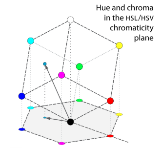
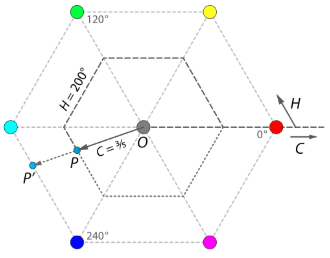
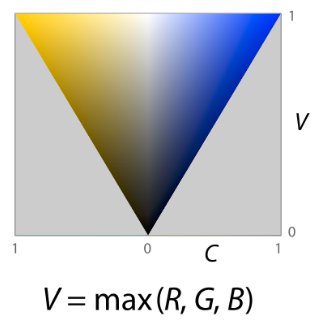
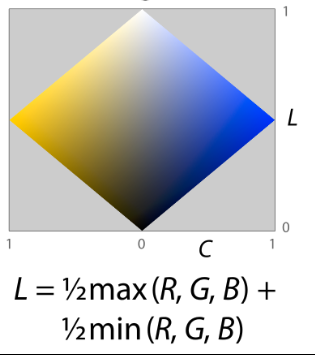
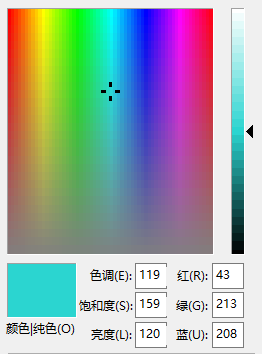

# HSL 与 HSV 颜色模型浅析

（注：HSB 与 HSV 是完全一样的，B 代表 **B**rightness，下文统一使用 HSV）

我们都知道，最常用的颜色模型是RGB，也就是 additive color model，通过三个分量，**R**ed，**G**reen 和 **B**lue 合成出各种颜色。还有一种模型也很常用，CMYK，也就是 subtractive color model，经常用在打印上，通过把颜色 **C**yan，**M**agenta，**Y**ellow（分别是 Red，Green，Blue 的反色） 混合在一起，来 “过滤” 掉这些颜色的光。

这两种颜色模型都很适合机器，但是对人类却不是很友好，因为表示的值并不是很直观。例如，RGB为 (43, 213, 208) 的颜色是什么呢？绝大多数人并不能马上意识到这究竟是什么颜色，事实上它是：

下面将对两种更符合人眼对颜色的认知的颜色模型进行简单介绍。

 

## HSL与HSV的概括

我们都知道，RGB是由三个分量组合而成，每个分量互不干扰，因此 RGB 模型可以用一个立方体来表示。

同理，HSL与HSV同样也可以用一个空间几何体来表示，它们分别为

HSL

HSV

为什么说这两种更符合人眼对颜色的认知方式呢？我们对颜色起名时，通常会有 “深蓝色”，“浅黄色”，“暗绿色” 之类的词语，说明我们是先大致把握住某个颜色是 “哪种” 颜色，比如红、黄等，然后再看它的明暗、深浅。HSL和HSV也是如此，**H**ue（色相，色调）表示刚刚说的大致的颜色，**S**aturation（饱和度）表示深浅（注：两个模型中的 Saturation 虽然名称一样，但是严格定义并不相同，下文会说明），**L**ightness（亮度）或 **V**alue 表示明暗。

下面将介绍每个参数的含义，以及一些简单的计算方法。这里约定，下文的 RGB 值的每个分量的取值为 [0, 1] 之间的实数，而不是 [0, 256) 之间的整数。

 

## Hue 与 Chroma

Chroma（色彩浓度）是上文未提到过的一个概念，在部分介绍 HSL 与 HSV 的文章里将其与 Saturation 混为一谈，事实上两者是不一样的，Chroma是一个中间变量，起辅助作用，Saturation 是由 Chroma 变来的，后文会有说明。

先把表示 RGB 的立方体旋转一个角度，使其立起来，即，使立方体主对角线垂直 “水平面” 。然后，把立方体中每个点投影到这个水平面上。

这样就得到了一个正六边形。

以上图中的灰色点（黑色点与白色点的投影重合）为原点，灰色点与红色点的连线为轴，建立极坐标系。RGB 立方体中某个点的 Hue 值即为该点的投影的极坐标角度值，因此 Hue 的取值为 [0°, 360°)。

然而，RGB 立方体中某个点的 Chroma 并不是该点的投影的极坐标长度值。Chroma 事实上是一个比例，假设 RGB 立方体的某个点的投影为点 P，延长 OP 交六边形于点 P' ，Chroma 即为 OP / OP'，因此 Chroma 的取值范围为 [0, 1]。

该如何计算 Chroma 呢？乍一看很复杂，先得把 RGB 立方体立起来，再投影到平面，再算个比例。实则非也，有简单的方法，证明略去。

Hue 的计算也不复杂，仔细想想即可明白，此处略去证明

参数 Hue 与 Chroma 在两种模型的含义是相同的。

再看这个六边形，如此有棱有角，怎么跟 HSL 或 HSV 的圆柱体模型联系在一起？这里将对这个六边形做一个类似缩放的变换。六边形中每个点都有两个参数，Hue 表示角度，Chroma 表示一个比例，何不将 Chroma 看作是长度，而重新建立一个极坐标系呢？

这样，棱和角就消失了，与圆柱体的联系也紧密了一些。

 

## Lightness

Hue 与 Chroma 的含义在两种模型中是相同的，而对于亮度，就各有各的见解了。在一张灰度图中，所有颜色仅由一个参数决定，从 0（纯黑）到 1（纯白），显然这个参数越大，亮度越高。但是在彩色图里，该如何表示亮度呢。

无论如何，大体上应该是 RGB 的每个分量越大，亮度越高。最容易想到的就是取三个分量的平均数作为 Lightness 值，这也是另一种称作 HSI 的模型中使用的方法（I for **I**ntensity）。

然后来看 HSV 模型中是如何表示亮度的（在该模型中亮度叫 Value 或者 Brightness）。HSV 的创始者认为，用 RGB 三个分量中最大的那一个作为 Value 很合适。现在看一下，对立起来的 RGB 立方体的一个剖面（先做一个面，使得主对角线在这个面内，用这个面来切立方体，得到剖面）中的每个点（颜色）映射到一个 Chroma-Value 平面内。下图表示的是沿 50° / 230° 切开的剖面映射后的图像

可以证明，在剖面中，在主对角线的同一侧，一定不存在这样的两种颜色，它们的 Chroma 和 Value 都相等。这只是某一个剖面，把切立方体的面旋转一圈，就得到了无数个这样的底面为 2 ，高为 1 的等腰三角形，它们合在一起就是一个圆锥了

这个圆锥的底面（顶面）就是上一部分六边形 “缩放” 后形成的圆。

再来看 HSL 的 Lightness，HSL 的创始者认为，亮度最好表示为 RGB 的三个分量中最大值与最小值的平均值，即 L = (M + m) / 2。我们同样沿 50° / 230° 切开一个剖面，再将其中的点（颜色）映射到 Chroma-Lightnesss 平面内

同样可以证明，在剖面中，在主对角线的同一侧，一定不存在这样的两种颜色，它们的 Chroma 和 Lightness 都相等。同样取各个方向的剖面，并把这些对角线长为 2 和 1 的菱形合在一起，得到一个双圆锥。

这个双圆锥的中间那个 “分界面”，即为上一部分六边形 “缩放” 后形成的圆。

 

## Saturation

HSL 的双圆锥模型和 HSV 的圆锥模型虽然很直观，但还是有一点瑕疵。比如，在 HSV 的 Chroma-Value 图中，可以发现，不存在这样一种颜色，它的 Chroma 为 1，Value 为 0。这就容易引起一些麻烦了，不能简单说 Chroma 与 Value 的取值均为 [0, 1]，因为二者之间存在一种制约关系。现在要做的，就是通过一种类似 “缩放” 的变换，把 Chroma-Value 图从一个三角形拉成一个矩形，使其充满，同理也把 HSL 的 Chroma-Lightness图拉成一个矩形

若对每个剖面都这样做，那么 HSV 的圆锥和 HSL 的双圆锥都会变成一个圆柱体，如本文开头的图片所示。

至此，HSL 与 HSV 中各个参数的含义就介绍完毕了。

 

## HSL 的直观感受

在 Windows 系统的画图程序中，可以直观地感受到 HSL。

左边的面板可以调 Hue 与 Saturation，右边的可以调 Lightness。

理论上，RGB 表示的颜色到 HSL 表示的颜色是有对应关系的（到 HSV 也是），它们表示的颜色范围相同，但由于误差原因，并不能完全做到对应得完全精准。在 Windows 的画图程序中，Hue 的取值为 [0, 239] 之间的整数，它由 [0, 360) 之间的实数通过乘以系数映射到 [0, 239] 并取最近的整数；Saturation 和 Lightness 类似，它们的取值都为 [0, 240] 之间的整数。

 

## 结语

本文虽介绍了 HSL 和 HSV 的概念，但尚有许多与这两种模型相关的问题没有涉及（比如 RGB 与 HSL 的互相转换），更具体的内容可以参阅网上的各种资料。本文对[该词条的维基][1]进行了大量借鉴，包括几乎所有图片在内。

[1]: https://en.wikipedia.org/wiki/HSL_and_HSV
