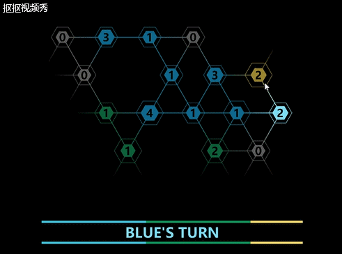

# 游戏的设计

本次制作了一个小型回合策略游戏，简单易上手。以下是关于游戏的一些设计。

## 游戏策划

**一、概述**

1.1 游戏名称

暂未定

1.2 游戏类型

回合策略

1.3 游戏内容

双方或多方势力在一块本来无军事力量的空地上扩张，率先灭掉其他所有势力的国家获胜。无兵种、无技能、无道具，纯粹的战略能力较量。

1.4 游戏风格

背景纯黑，音乐压抑，营造一种紧张的氛围。

1.5 玩家体验

玩家扮演一位在战略层面上发布指令的司令角色，可以在随机生成的地图上分析何为战略要点、何处应该增兵等等，符合玩家喜欢操纵全局的心理。

**二、背景**

（世界观架空、纯属虚构）自从超级大国A国发现了旁边的玛斯星地下含有取之不尽的稀有矿物资源后，各国的侦测器也相继把探测数据发送回鄂斯星，发现A国的报告属实。本来国际形势早已不如以往，玛斯星矿物资源的发现更加剧了各国之间的矛盾。鄂斯星最大的国际组织——U组织为了尽量缓和紧张氛围，颁布了法律，规定可以在不干扰他国进行矿物研究、采集等活动的情况下，可以自由对玛斯星上的矿物进行处理。

在某个平常的一天，忽有星际海盗的机器人兵力登陆玛斯星，全都印着A国国旗，把正在采集矿物的K国机器人尽数消灭，并掠夺了当天采集到的所有矿物。

无论A国外交官如何解释，K国也无法释怀。事实上，两国几百年前就一直有仇恨，K国是不会放弃这个契机来发动一场战争的。于是，过了一个月，K国的机械部队对A国以眼还眼，略夺回来的矿物全部流入黑市，假装不关K国什么事。

事态越发严重，最终演变成A国与K国之间的机械战争。由于矿物作为战利品相当值钱，别的国家也不甘心让大部分矿物流入这两国，于是也纷纷加入了这场战争。在别的星球上的世界大战，开始了……

**三、设计元素**

地图：每块地采用一个六边形来表示，地与地之间若是联通的则用一条线段连接起来，这就形成了一个图结构，边可以控制地形，地图是随机生成的。一块地最多可以与六块地相连。

兵力：每块地上有一个数字显示兵力。地有大与小之分，大的最大可容纳12单位兵力，小的最大可容纳8单位兵力。不同势力的兵力用不同的颜色区分。

战争迷雾：最大视野为1格，也就是说只能看到与本势力相邻的地的情况。

**四、游戏机制**

4.1 基本流程

每个势力轮流行动，在自己的回合中分两个 Phase，Phase 0 是Main Phase，在这个 Phase 中玩家可以占领空土地，可以与其他驻扎军队战斗。Phase 1 是 End Phase，在这个 Phase 中玩家可以为每块己势力土地扩充兵力，即 “加点”。最后仅剩唯一一个势力是己势力时，游戏获胜。

4.2 占领空土地

空土地用一个深灰色的 0 来表示，占领它将在原地留下 1 单位兵力，并把剩余兵力全部用来占领。

4.3 战斗

战斗结果将根据双方的兵力决定，若胜利，则在原地留下 1 单位兵力，并把未阵亡的剩余兵力全部占领敌对势力土地；若失败，则会削弱敌方兵力，并且自己仅会在原地留下 1 单位兵力。

4.4 增兵（加点）

End Phase 中，将根据已占领土地数量，来给予可增的兵力数（可加的点数）。

**五、AI系统**

由于只是个 Demo，AI 采用的办法是完全随机移动、随机加点。不过可以通过增加 AI 玩家的个数来增加游戏难度。

**六、系统功能**

6.1 游戏开始前

可以对游戏内容进行设置，包括设置地图规模、设置 AI 数量、是否开启迷雾等。除此之外，还可以读取进度。

6.2 游戏时

可以暂停、按照当前地图重开一把、按照当前游戏设置重开一个地图、保存并退出。

6.3 操作方式

鼠标左键控制移动、战斗、加点，长按左键可以给某一格加满，右键可进入 End Phase，中键可拖动地图，滚轮可调整玩家视野大小。

 

## CRC 卡片

本游戏唯一的对象就是地。

Object : 地

Attribute : 颜色（势力）、兵力、连通性

Collaborator | Events | Situation | Actions
:-:|:-:|:-:|:-:
-|LB clicked|未选中任何地|选中该地
-|LB clicked|已有选中的地|尝试占领或战斗
-|LB clicked|End Phase|兵力加一（如果未满）
-|LB holded|End Phase|兵力加满

 

## 成果

