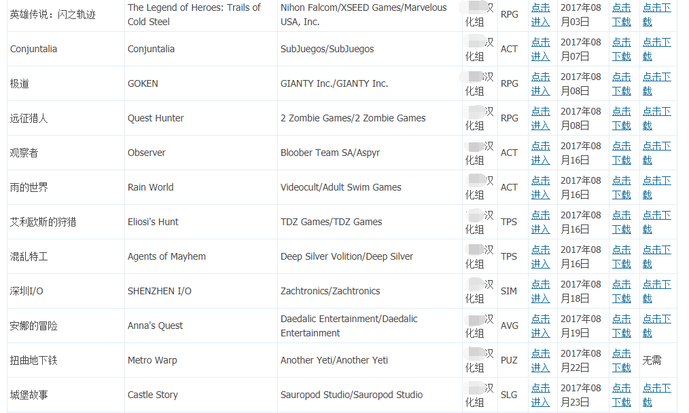

# 盗版软件

大部分人都玩过曾经十分流行的《植物大战僵尸》，殊不知自己免费下载到的游戏，其实并不是免费的（事实上，正版甚至不支持中文）。国内破解软件非常流行，这对软件开发商是极不友好的，在游戏行业更是如此。

玩家不需要花费一分钱，便可以享受到开发团队花费数月、数年的工夫制作出来的成果，这便是盗版（破解版）的游戏。

曾经，在我国，破解团队是被视作英雄般的存在，因为国内没有什么渠道获取正版。随着经济的发展，国人版权意识逐渐提高，但仍然存在破解软件的现象。

总之，具体怎么做最妥，还是看大众舆论和国家法律吧。
